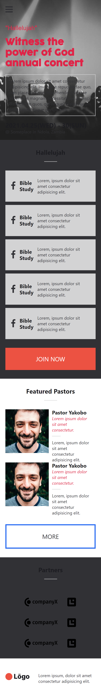

# koncert
​
> Koncert is a plaform where you can search and find active and upcoming concerts near you.
​

​
## Built With
​
- HTML5
- CSS3
​
## Live Demo
​
[Live Demo Link](https://themwi.github.io/koncert/)
​
## Getting Started

To get a local copy up and running follow these simple example steps.

### Prerequisites

- You must have git installed

### Install

- Clone the git repository

> run git clone https://github.com/themwi/koncert.git in your terminal

### Usage

- Find the HTML index file and open it from localhost or directly from your browser
​
## Authors
​
👤 **Mwila Kaunda**
​
- GitHub: [@Mwila-Kaunda](https://github.com/themwi)
- Twitter: [@MwilaKaunda](https://twitter.com/MwilaKaunda)
- LinkedIn: [Mwila Kaunda](https://www.linkedin.com/in/MwilaKaunda/)

## Contributing
​
Contributions, issues, and feature requests are welcome!
​
Feel free to check the [issues page](https://github.com/themwi/koncert/issues).
​
## Show your support
​
Give a ⭐️ if you like this project!
​
## Acknowledgments
​
- To my coding partner who helped me through all the work
- To my Stand Up Team who kept my morale up!